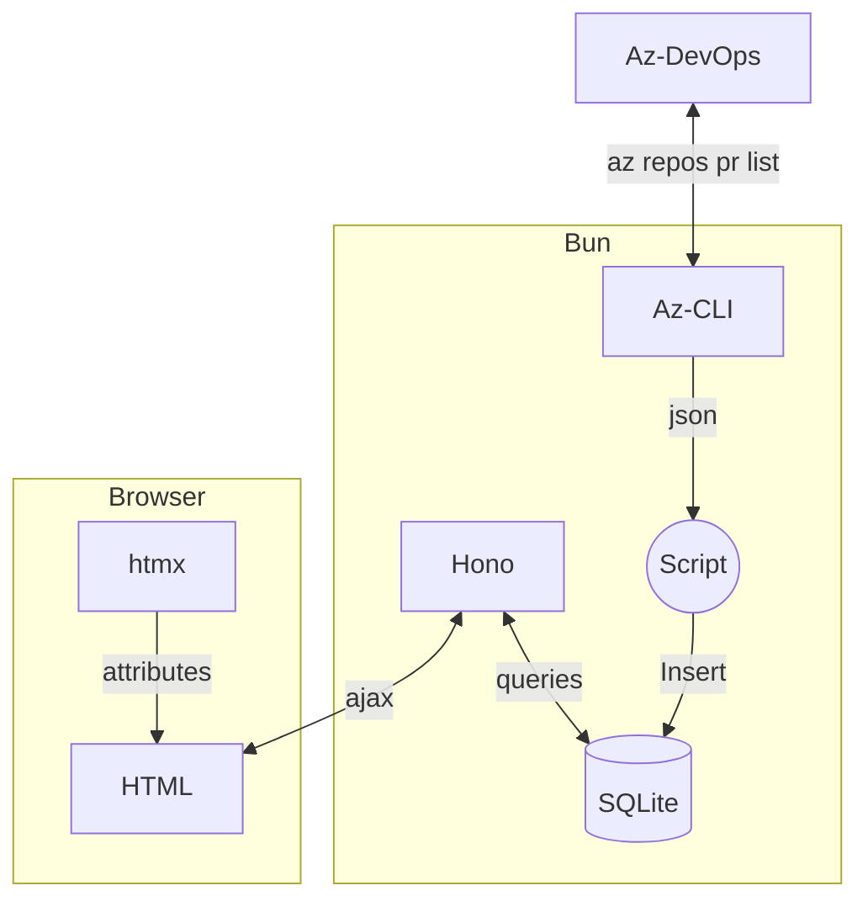

# PR Dashboard
Show data related to pull requests

## Steps to run

### Install dependencies:

```sh
bun install
```

### Build the database:

Get the azure cli with devops extension and run this in the command line:
```sh
$ az login --allow-no-subscriptions
$ fetch-prs.fish
```

### Run
```sh
$ bun run dev
```

### Open in browser
open http://localhost:4000

### System Diagram

